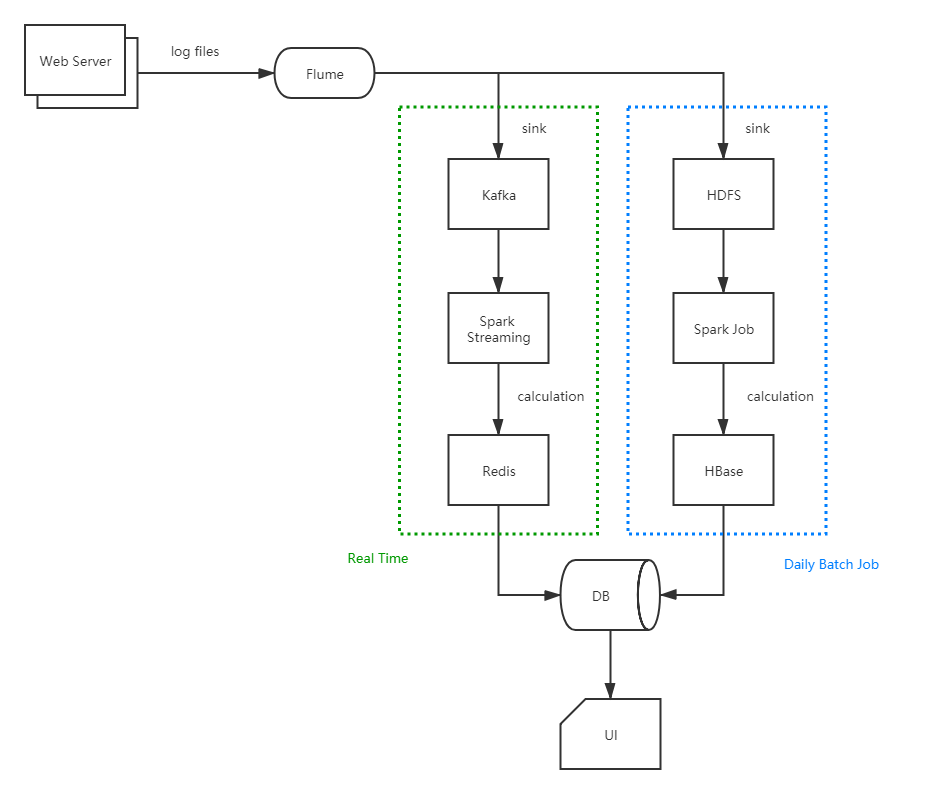

# BIG DATA EZ

大数据学习项目乱炖

项目目录说明：
- data: 存放测试数据
- src/java: 存放代码
- src/resources: 存放配置文件

## 项目

Hadoop
- HdfsTest: 基本 HDFS 读写功能
- HBaseTest: 基本 HBase 读写功能
- WordCountApp: 经典 Map Reduce 案例
- PageStatApp: 在 WC 基础之上，处理日志文件，统计每个页面的访问量
- ETLApp: 对日志文件进行简单数据清洗

Spark
- basic/HelloWorld: 入门
- adv_1/ParserApp: 基本的数据清洗
- adv_2/LogEtlApp: 大致的 ETL 流程
- adv_3/AnalysisApp: 后续数据分析
- streaming/app/StreamingAnalysisApp: 处理实时流数据

Zookeeper
- ZkClient: Zookeeper 客户端实现基本 CRUD 功能

Scala
- Collection 关键字
- Function 关键字
- Iimplicit 关键字
- Match 操作
- IO 操作

## 流程

